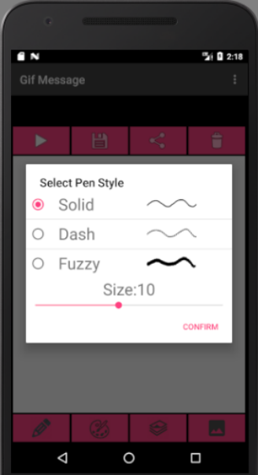
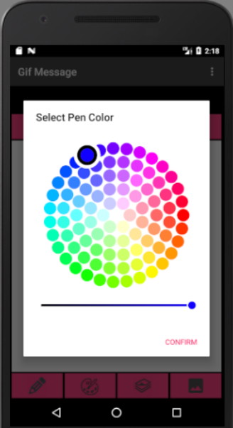
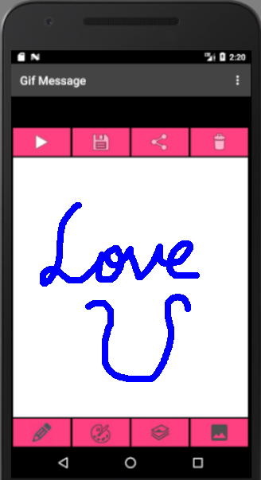

# LiveMessage

  

## Join development!

**Start contributing:** Fork this repository and contribute back using pull requests to the master branch. Easy starting points are also reviewing [pull requests](https://github.com/Kuanlin-Chen/LiveMessage/pulls)
